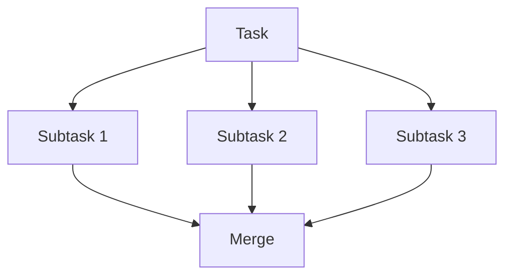

# llm_physics System Architecture

**Version**: 1.0.0
**Last Updated**: 2025-11-06
**Status**: Production-Ready

---

## Table of Contents

1. [System Overview](#system-overview)
2. [Architecture Principles](#architecture-principles)
3. [Technology Stack](#technology-stack)
4. [Directory Structure](#directory-structure)
5. [Component Architecture](#component-architecture)
6. [Agentic Orchestration Layer](#agentic-orchestration-layer)
7. [CI/CD Pipeline](#cicd-pipeline)
8. [Security Architecture](#security-architecture)
9. [Testing Architecture](#testing-architecture)
10. [Deployment Architecture](#deployment-architecture)
11. [Monitoring and Observability](#monitoring-and-observability)
12. [Scalability Considerations](#scalability-considerations)
13. [Future Architecture Evolution](#future-architecture-evolution)

---

## System Overview

**llm_physics** is a monorepo for reproducible physics LLM tooling with Next.js/Tailwind frontends and comprehensive agentic automation workflows.

### High-Level Architecture

```

                    User / Developer                          

                 
                 

              AI Agent Layer (Universal)                      
     
   Claude    GPT-4      Gemini    Future Agents         
     
                                                             
                                                             
     
       Agentic Orchestration Protocol (.agentic/)         
    - Core Workflows    - Security Compliance             
    - Testing Standards - Multi-Agent Coordination        
     

                 
                 

                  Application Layer                           
     
            Next.js 16 App Router                          
    - React 19 Server Components                           
    - Tailwind CSS v4                                      
    - TypeScript (strict mode)                             
     

                 
                 

                 Infrastructure Layer                         
    
     Vercel      GitHub      MCP          Audit        
    (Deploy)     (CI/CD)    (Services)    (Logs)       
    

```

### Key Characteristics

- **Monorepo**: Single repository with all code, tests, docs, and configs
- **Reproducible**: Locked dependencies, explicit configuration, no external assets
- **Auditable**: All actions logged, compliance enforced, 90-day retention
- **Agent-Native**: Designed for AI-driven development with human oversight
- **Extensible**: Plugin architecture for agents, commands, and workflows

---

## Architecture Principles

### 1. Reproducibility First

**Definition**: Any developer or agent can clone the repo and get identical behavior.

**Implementation**:
- `package-lock.json` for exact dependency versions
- No external CDNs or assets
- Explicit environment variable documentation
- Deterministic build process
- Version-pinned tooling

**Validation**:
```bash
npm ci && npm run build
# Should produce identical output on any machine
```

### 2. Auditability by Default

**Definition**: All actions are logged and traceable.

**Implementation**:
- Structured JSON logs in `artifacts/audit_logs/`
- Git commit messages with detailed context
- CI/CD pipeline artifacts retention
- MCP call logging
- Agent action tracking

**Audit Log Format**:
```json
{
  "timestamp": "ISO-8601",
  "actor": "agent|human|ci",
  "action": "file_edit|deploy|test|...",
  "target": "file/path or resource",
  "result": "success|failure",
  "metadata": {}
}
```

### 3. Security by Design

**Defense in Depth**:
1. **Input Validation**: All user and agent inputs sanitized
2. **Secret Management**: Environment variables only, never in code
3. **Authentication**: All endpoints require explicit auth
4. **Rate Limiting**: Prevent abuse of public APIs
5. **Audit Logging**: Track all security-relevant actions
6. **Compliance Enforcement**: CI blocks on security issues

### 4. Testability at Every Layer

**Coverage Requirements**: >95% for all metrics

**Test Pyramid**:
```
       
          E2E     Playwright (few, critical paths)
       
     
       Component    React Testing Library (moderate)
     
   
      Unit Tests      Jest (many, fast, isolated)
   
```

### 5. Agent-First Development

**Principle**: Code should be optimized for both human and agent readability.

**Practices**:
- Clear, descriptive naming
- Explicit over implicit
- Comprehensive inline documentation
- Structured, machine-parseable configs
- Deterministic behavior

---

## Technology Stack

### Frontend

| Technology | Version | Purpose |
|------------|---------|---------|
| **Next.js** | 16.0.1 | React framework with App Router |
| **React** | 19.2.0 | UI library with Server Components |
| **Tailwind CSS** | 4.x | Utility-first styling |
| **TypeScript** | 5.x | Type-safe JavaScript |

### Build & Tooling

| Tool | Purpose |
|------|---------|
| **npm** | Package management |
| **ESLint** | Code linting |
| **Jest** | Unit and component testing |
| **React Testing Library** | Component testing utilities |
| **Playwright** | E2E testing (planned) |

### Infrastructure

| Service | Purpose |
|---------|---------|
| **Vercel** | Hosting and deployment |
| **GitHub Actions** | CI/CD pipeline |
| **MCP** | Model Context Protocol for agent integrations |

### Agentic Layer

| Component | Purpose |
|-----------|---------|
| **.agentic/** | Universal agent protocols |
| **.claude/** | Claude-specific configurations |
| **scripts/** | Automation and compliance scripts |
| **artifacts/** | Generated logs and artifacts |

---

## Directory Structure

### Complete Directory Tree

```
llm_physics/

 .agentic/                      # Universal agentic protocols
    protocols/                 # Protocol definitions
       core-workflow.md
       testing-standards.md
       security-compliance.md
       git-conventions.md
    examples/                  # Example workflows
       test-generation-workflow.md
       feature-implementation-workflow.md
       bug-fix-workflow.md
    templates/                 # Reusable templates
        agent-spec-template.md
        workflow-template.md
        test-template.tsx

 .claude/                       # Claude-specific configs
    agents/
       test-autogen-agent.md
       vercel-deploy-specialist.md
       repo-auditor.md
    commands/
       generate-tests.md
       deploy-vercel.md
       audit-repo.md
    settings.json
    README.md

 .claude-plugin/
    marketplace.json           # Version-pinned plugins

 .github/
    workflows/
        ci.yml                 # Standard CI
        claude-pr-review.yml   # Automated PR review
        claude-vercel-ci.yml   # Deployment workflow

 app/                           # Next.js application
    page.tsx                   # Root page
    layout.tsx                 # Root layout
    globals.css                # Global styles

 tests/                         # Test files
    page.test.tsx              # Component tests

 scripts/                       # Utility scripts
    verify_audit_block.js      # Compliance checker

 artifacts/                     # Generated artifacts
    audit_logs/                # Audit trail (gitignored)
        .gitkeep

 docs/                          # Additional documentation

 mocks/                         # Test mocks

 public/                        # Static assets

 coverage/                      # Test coverage (gitignored)

 .next/                         # Next.js build (gitignored)

 node_modules/                  # Dependencies (gitignored)

 .mcp.json                      # MCP server configurations
 .gitignore
 AGENTS.md                      # Universal agent guide
 ARCHITECTURE.md                # This file
 CLAUDE.md                      # Project policies
 CONTRIBUTING.md                # Contribution guide
 README.md                      # User documentation
 package.json
 package-lock.json
 tsconfig.json
 next.config.ts
 jest.config.js
 jest.setup.js
 eslint.config.mjs
 postcss.config.mjs
```

### Directory Ownership

| Directory | Owned By | Purpose |
|-----------|----------|---------|
| `.agentic/` | All agents | Universal protocols |
| `.claude/` | Claude agents | Claude-specific |
| `app/` | Developers | Application code |
| `tests/` | Developers & agents | Test suites |
| `scripts/` | DevOps & agents | Automation |
| `artifacts/` | CI/CD & agents | Generated data |
| `docs/` | Documentation team | Extra docs |

---

## Component Architecture

### Next.js App Router Structure

```
app/
 page.tsx              # Root route "/"
 layout.tsx            # Root layout (wraps all pages)
 globals.css           # Global Tailwind imports

 [future features]/
     warp-ui/          # Warp visualization component
     audit-console/    # Audit log viewer
     orb-panel/        # Physics simulation panel
```

### Component Design Patterns

#### 1. Server Components (Default)

```typescript
// app/page.tsx
export default function Page() {
  // Rendered on server, can fetch data directly
  return <div>...</div>
}
```

**When to use**:
- Static content
- SEO-critical pages
- Data fetching without client state

#### 2. Client Components

```typescript
// app/components/Interactive.tsx
'use client'

import { useState } from 'react'

export default function Interactive() {
  const [state, setState] = useState(0)
  return <button onClick={() => setState(s => s + 1)}>{state}</button>
}
```

**When to use**:
- User interactions
- Browser APIs (window, localStorage)
- React hooks (useState, useEffect)

#### 3. Shared Components

Place reusable components in `app/components/`:

```
app/
 components/
    ui/              # Reusable UI primitives
       Button.tsx
       Input.tsx
       Modal.tsx
    features/        # Feature-specific components
        WarpUI.tsx
        AuditConsole.tsx
```

---

## Agentic Orchestration Layer

### Agent Types

#### 1. **Specialized Agents** (Task-Specific)

Located in `.claude/agents/` (Claude) or `.agentic/protocols/agents/` (Universal)

Examples:
- `test-autogen-agent`: Test generation
- `vercel-deploy-specialist`: Deployment
- `repo-auditor`: Compliance auditing

#### 2. **General-Purpose Agents** (Multi-Task)

Any AI with general capabilities (Claude, GPT-4, Gemini, etc.)

Responsibilities:
- Code implementation
- Bug fixes
- Documentation
- Code review

### Agent Communication Protocol

```

   Agent A   

        1. Write state
       

  Shared File System 
  artifacts/agent_state/

        2. Read state
       

   Agent B   

```

**Message Format**:
```json
{
  "from": "agent-a",
  "to": "agent-b",
  "task": "generate tests for WarpUI",
  "status": "completed",
  "artifacts": ["tests/WarpUI.test.tsx"],
  "metadata": {
    "coverage": 98,
    "test_count": 12
  }
}
```

### Workflow Orchestration

#### Sequential Workflow


#### Parallel Workflow



---

## CI/CD Pipeline

### Pipeline Stages

```

                    CI/CD Pipeline                            


On PR:
  1. Checkout code
  2. Setup Node.js 20.x
  3. Install dependencies (npm ci)
  4. Run linter (npm run lint)
  5. Run tests with coverage (npm test -- --coverage)
  6. Check coverage threshold (>95%)
  7. Build application (npm run build)
  8. Run audit script (node scripts/verify_audit_block.js)
  9. Upload artifacts (coverage, audit logs)
  10. Comment on PR with results
  11.  Pass or  Fail

On Merge to Main:
  1. All PR checks must pass
  2. Pre-deployment validation
  3. Trigger Vercel deployment (via MCP)
  4. Monitor deployment status
  5. Post-deployment health checks
  6. Validate Core Web Vitals
  7. On failure: automatic rollback
  8. Generate deployment audit log
  9.  Deploy successful or  Rollback
```

### Workflow Files

#### `.github/workflows/ci.yml`

Standard CI for all PRs:
- Lint
- Test
- Build

#### `.github/workflows/claude-pr-review.yml`

Enhanced PR review:
- All standard CI checks
- Coverage validation (>95%)
- Audit script execution
- Artifact uploads
- PR comment with results

#### `.github/workflows/claude-vercel-ci.yml`

Deployment workflow:
- Pre-deployment checks
- Vercel deployment (via MCP or CLI)
- Health monitoring
- Post-deployment audit
- Rollback on failure

### Secrets Management

Required GitHub Secrets:
- `VERCEL_TOKEN`: Vercel API token
- `VERCEL_PROJECT_ID`: Project identifier
- `ANTHROPIC_API_KEY`: (optional) For Claude-specific workflows

---

## Security Architecture

### Threat Model

#### Assets to Protect
1. Source code
2. Environment variables / secrets
3. User data (future)
4. Deployment infrastructure
5. CI/CD pipeline

#### Threat Actors
1. External attackers
2. Compromised dependencies
3. Malicious agents (rogue AI)
4. Insider threats
5. Supply chain attacks

### Security Controls

#### 1. **Input Validation**

All inputs (user, agent, API) must be validated:
```typescript
// Example
function processInput(input: unknown): SafeInput {
  if (!isValidInput(input)) {
    throw new ValidationError('Invalid input')
  }
  return sanitize(input)
}
```

#### 2. **Secret Management**

```

     Secret Management Flow          


Development:
  - Use .env.local (gitignored)
  - Never commit secrets
  - Document in .mcp.json

CI/CD:
  - Use GitHub Secrets
  - Inject at runtime
  - Never log secrets

Production:
  - Use Vercel Environment Variables
  - Rotate regularly
  - Monitor usage
```

#### 3. **Audit Logging**

All security-relevant actions logged:
```json
{
  "timestamp": "2025-11-06T13:00:00Z",
  "actor": "agent-name",
  "action": "file_read",
  "resource": ".env",
  "result": "blocked",
  "reason": "secrets file"
}
```

#### 4. **Compliance Enforcement**

```python
# Pseudocode for compliance checker
def enforce_compliance():
    findings = []

    # Check for secrets
    if has_exposed_secrets():
        findings.append(Finding(CRITICAL, "Exposed secrets"))

    # Check coverage
    if coverage < 95:
        findings.append(Finding(HIGH, "Low coverage"))

    # Check vulnerabilities
    if has_vulnerabilities():
        findings.append(Finding(CRITICAL, "Vulnerabilities"))

    if any(f.severity == CRITICAL for f in findings):
        block_merge()

    return findings
```

---

## Testing Architecture

### Test Strategy

```
Test Pyramid:

       
            E2E       ~5% (Playwright)
          (Slow)    
       
     
         Component        ~20% (React Testing Library)
         (Medium)       
     
   
          Unit              ~75% (Jest)
          (Fast)          
   
```

### Test Patterns

#### Unit Test Pattern

```typescript
// tests/utils/formatData.test.ts
describe('formatData', () => {
  it('should format valid data', () => {
    const result = formatData({ value: 42 })
    expect(result).toBe('42')
  })

  it('should handle null input', () => {
    const result = formatData(null)
    expect(result).toBe('N/A')
  })

  it('should throw on invalid input', () => {
    expect(() => formatData('invalid')).toThrow()
  })
})
```

#### Component Test Pattern

```typescript
// tests/components/WarpUI.test.tsx
import { render, screen, waitFor } from '@testing-library/react'
import userEvent from '@testing-library/user-event'
import WarpUI from '@/app/components/WarpUI'

describe('WarpUI Component', () => {
  it('should render and handle user interaction', async () => {
    render(<WarpUI />)

    const button = screen.getByRole('button', { name: /activate/i })
    await userEvent.click(button)

    await waitFor(() => {
      expect(screen.getByText(/activated/i)).toBeInTheDocument()
    })
  })
})
```

### Coverage Enforcement

```bash
# jest.config.js
module.exports = {
  coverageThreshold: {
    global: {
      branches: 95,
      functions: 95,
      lines: 95,
      statements: 95,
    },
  },
}
```

---

## Deployment Architecture

### Vercel Deployment Flow

```

              Vercel Deployment Flow                     


1. Trigger:
   - git push to main
   - Manual deploy via MCP
   - PR preview deployment

2. Build:
   - Install dependencies (npm ci)
   - Run build (npm run build)
   - Generate static pages
   - Optimize assets

3. Deploy:
   - Upload to Vercel edge network
   - Assign unique URL
   - Configure custom domain (if any)

4. Validate:
   - Health check endpoint
   - Core Web Vitals measurement
   - Performance budget validation

5. Activate:
   - If validation passes: make live
   - If validation fails: rollback to previous
   - Log deployment audit

6. Monitor:
   - Real-time error tracking
   - Performance metrics
   - User analytics
```

### Deployment Environments

| Environment | Branch | URL | Purpose |
|-------------|--------|-----|---------|
| **Production** | `main` | llm-physics.vercel.app | Live site |
| **Preview** | `claude/*` | `<hash>.vercel.app` | PR previews |
| **Development** | Local | `localhost:3000` | Local dev |

### Rollback Strategy

```python
def deploy_with_rollback():
    previous_deployment = get_current_deployment()

    new_deployment = create_deployment()

    if not health_check(new_deployment):
        rollback_to(previous_deployment)
        raise DeploymentFailed("Health check failed")

    if not validate_performance(new_deployment):
        rollback_to(previous_deployment)
        raise DeploymentFailed("Performance budget exceeded")

    activate(new_deployment)
    log_deployment(new_deployment)
```

---

## Monitoring and Observability

### Metrics to Track

#### Application Metrics
- **Core Web Vitals**: LCP, FID, CLS
- **Page Load Time**: TTFB, FCP, TTI
- **Bundle Size**: JavaScript, CSS
- **API Response Times**: (future)

#### Infrastructure Metrics
- **Deployment Frequency**: Per day/week
- **Deployment Success Rate**: %
- **Rollback Rate**: %
- **Build Time**: Seconds

#### Quality Metrics
- **Test Coverage**: % (target: >95%)
- **Lint Pass Rate**: % (target: 100%)
- **Audit Pass Rate**: % (target: 100%)
- **Bug Escape Rate**: Per deployment

### Logging Strategy

```
artifacts/audit_logs/
 audit-2025-11-06T13-00-00-000Z.json
 deploy-2025-11-06T14-00-00-000Z.json
 agent-actions-2025-11-06.jsonl
 mcp-calls-2025-11-06.jsonl
```

**Log Retention**: 90 days minimum

---

## Scalability Considerations

### Current Scale

- **Users**: Limited (dev team + agents)
- **Requests**: Low
- **Data**: Minimal
- **Deployments**: Multiple per day

### Scaling Strategy

#### Horizontal Scaling (Future)
- Vercel auto-scales edge functions
- Static pages served from CDN
- No database yet (future: consider serverless DB)

#### Vertical Scaling (Not Needed)
- Next.js optimizations sufficient
- Bundle splitting for large apps
- Image optimization via Next.js Image

#### Caching Strategy
- Static pages: Cached indefinitely
- Dynamic pages: Cache at CDN edge
- API responses: Cache with appropriate TTL

---

## Future Architecture Evolution

### Phase 1: Current (MVP)
-  Next.js + Tailwind baseline
-  Agentic orchestration
-  CI/CD pipeline
-  Audit and compliance

### Phase 2: Enhanced UI (Q1 2026)
- [ ] Warp UI visualization
- [ ] Audit console
- [ ] Orb panel for physics simulations
- [ ] Dark mode

### Phase 3: Backend Integration (Q2 2026)
- [ ] API routes for data fetching
- [ ] Database integration (Postgres/Drizzle)
- [ ] User authentication
- [ ] Real-time features (WebSockets)

### Phase 4: Advanced Agentic (Q3 2026)
- [ ] Multi-agent swarms
- [ ] Real-time agent collaboration
- [ ] Agent marketplace
- [ ] Autonomous feature development

### Phase 5: Production Hardening (Q4 2026)
- [ ] Performance monitoring (Datadog/Sentry)
- [ ] Advanced security (WAF, DDoS protection)
- [ ] Multi-region deployment
- [ ] Disaster recovery

---

## Appendix

### Key Technologies Deep Dive

#### Next.js 16 App Router

**Server Components**:
- Default for all components
- Rendered on server, sent as HTML
- Can fetch data directly without client state
- Better performance, SEO

**Client Components**:
- Opt-in with `'use client'`
- Hydrated on client
- Can use React hooks
- For interactivity

**File-Based Routing**:
```
app/
 page.tsx            /
 about/
    page.tsx        /about
 posts/
     [id]/
         page.tsx    /posts/:id
```

#### Tailwind CSS v4

**Utility-First**:
```tsx
<div className="flex items-center justify-between p-4 bg-gray-100 rounded-lg">
  <h1 className="text-2xl font-bold">Title</h1>
  <button className="px-4 py-2 bg-blue-500 text-white rounded hover:bg-blue-600">
    Click
  </button>
</div>
```

**Customization** (via `@theme` in globals.css):
```css
@import "tailwindcss";

@theme {
  --color-primary: #3b82f6;
  --font-display: "Inter", sans-serif;
}
```

#### TypeScript Strict Mode

**tsconfig.json**:
```json
{
  "compilerOptions": {
    "strict": true,
    "noUncheckedIndexedAccess": true,
    "exactOptionalPropertyTypes": true
  }
}
```

**Benefits**:
- Catch bugs at compile time
- Better IDE support
- Self-documenting code
- Refactoring safety

---

## Conclusion

This architecture is designed for:
- **Reproducibility**: Anyone can build it
- **Maintainability**: Easy to understand and extend
- **Scalability**: Can grow with needs
- **Agility**: Fast iterations with agents
- **Quality**: Enforced standards and testing

**Next Steps**:
1. Review this document with team
2. Implement Phase 2 features
3. Gather feedback from agents
4. Iterate and improve

---

**Document Version**: 1.0.0
**Last Updated**: 2025-11-06
**Authors**: llm_physics team + AI agents

*For questions or updates, open a GitHub issue.*

---

*End of Architecture Document*
